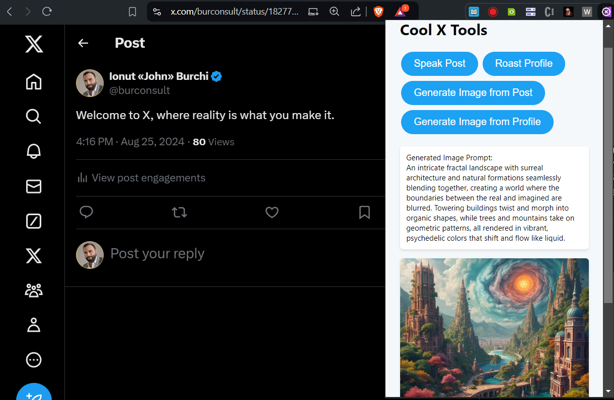

# Cool X Tools

Cool X Tools is a browser extension that enhances your experience on X (formerly Twitter) with a suite of fun! and useful? features.

## Features

- **Roast and Prompt Generation**: Post and profile data is processed to generate roasts and prompts using Claude AI via the Anthropic API.
- **Text-to-Speech**: Convert posts to speech for easy listening via the ElevenLabs API.
- **Image Generation**: Create images based on post content or custom prompts with image generation models via the Replicate API.

## Installation

1. Clone or download the Cool X Tools repository from GitHub
2. Open Chrome and navigate to chrome://extensions/
3. Enable "Developer mode" in the top right corner
4. Click "Load unpacked" and select the directory containing the extension files
5. Click on the extension icon in your browser to open the popup
6. Go to the settings page by clicking the "Settings" link in the popup
7. Enter your API keys for the services used (Anthropic, ElevenLabs, Replicate)
8. Customize other settings as desired

## Usage

1. Navigate to X.com
2. Click on the Cool X Tools icon in your browser toolbar to open the popup
3. Use the various tools available:
   - Use "Speak Post" to hear the content of a post
   - Select "Generate Image" to create an image based on post content or profile
   - Click on a profile and select "Roast Profile" for an AI generated roast

## Configuration

In the settings page, you can customize:
- API keys for Anthropic, ElevenLabs, and Replicate
- Voice ID for text-to-speech
- Replicate model for image generation
- Custom prompts for roasts and image generation

## Privacy

Cool X Tools processes data locally and through secure API calls. We do not store any of your personal data or X content. API keys are encrypted and stored locally on your device.

## Notes

- This is a proof of concept and is not intended for production use.
- This extension is currently only supported in Chromium based browsers (Chrome, Edge, Brave, etc.)

## Support

If you encounter any issues or have questions, please [open an issue](https://github.com/burconsult/Cool-X-Tools/issues) on our GitHub page.

## Contributing

We welcome contributions! Forking the repository and submitting a pull request is the best way to contribute.

## License

Cool X Tools is released under the [MIT License](https://github.com/burconsult/Cool-X-Tools/blob/main/LICENSE).